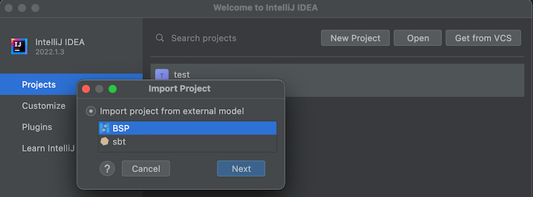
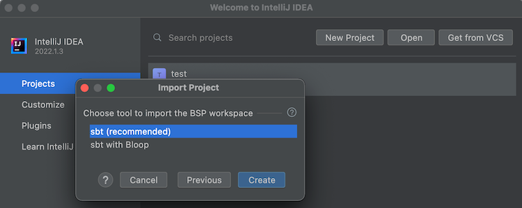
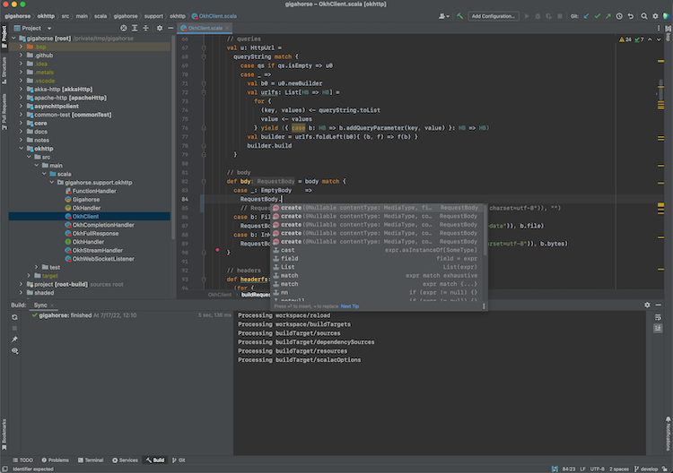
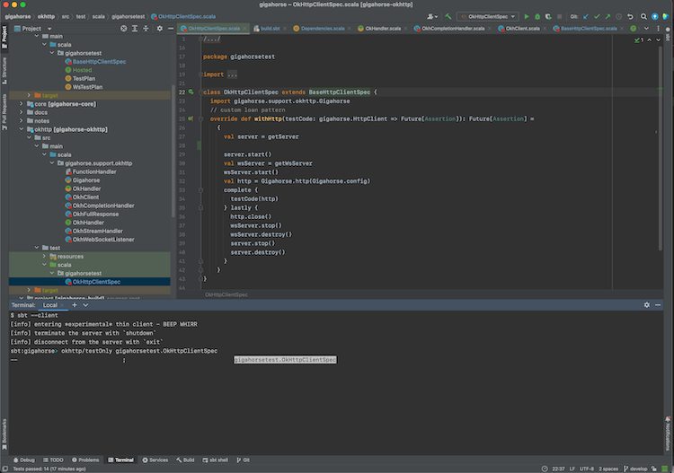

Import to IntelliJ IDEA
=======================

  [intellij]: https://www.jetbrains.com/idea/
  [intellij-debugging]: https://www.jetbrains.com/help/idea/debugging-code.html
  [intellij-scala-plugin-2021-2]: https://blog.jetbrains.com/scala/2021/07/27/intellij-scala-plugin-2021-2/#Compiler-based_highlighting
  [bsp]: https://build-server-protocol.github.io/

```admonish warning
This is a draft documentation of sbt 2.x that is yet to be released.
This is a placeholder, copied from sbt 1.x.
```

Objective
---------

I want to import sbt build to IntelliJ IDEA.

Steps
-----

[IntelliJ IDEA][intellij] is an IDE created by JetBrains, and the Community Edition is open source under Apache v2 license. IntelliJ integrates with many build tools, including sbt, to import the project.

To import a build to IntelliJ IDEA:

1. Install Scala plugin on the Plugins tab:<br>
   
2. From Projects, open a directory containing a `build.sbt` file.<br>
   
3. Once the import process is complete, open a Scala file to see that code completion works.

IntelliJ Scala plugin uses its own lightweight compilation engine to detect errors, which is fast but sometimes incorrect. Per [compiler-based highlighting][intellij-scala-plugin-2021-2], IntelliJ can be configured to use the Scala compiler for error highlighting.

### Interactive debugging with IntelliJ IDEA

1. IntelliJ supports interactive debugging by setting break points in the code:<br>
   
2. Interactive debugging can be started by right-clicking on an unit test, and selecting "Debug '&lt;test name&gt;'." Alternatively, you can click the green "run" icon on the left part of the editor near the unit test.
   When the test hits a break point, you can inspect the values of the variables:<br>
   

See [Debug Code][intellij-debugging] page on IntelliJ documentation for more details on how to navigate an interactive debugging session.

Alternative
-----------

### Using sbt as IntelliJ IDEA build server (advanced)

Importing the build to IntelliJ means that you're effectively using IntelliJ as the build tool and the compiler while you code (see also [compiler-based highlighting][intellij-scala-plugin-2021-2]).
While many users are happy with the experience, depending on the code base some of the compilation errors may be false, it may not work well with plugins that generate sources, and generally you might want to code with the identical build semantics as sbt.
Thankfully, modern IntelliJ supports alternative _build servers_ including sbt via the [Build Server Protocol][bsp] (BSP).

The benefit of using BSP with IntelliJ is that you're using sbt to do the actual build work, so if you are the kind of programmer who had sbt session up on the side, this avoids double compilation.

<table class="table table-striped">
  <tr>
    <th><nobr></th>
    <th>Import to IntelliJ</th>
    <th>BSP with IntelliJ</th>
  </tr>
  <tr>
    <td>Reliability</td>
    <td>✅ Reliable behavior</td>
    <td>⚠️ Less mature. Might encounter UX issues.</td>
  </tr>
  <tr>
    <td>Responsiveness</td>
    <td>✅</td>
    <td>⚠️</td>
  </tr>
  <tr>
    <td>Correctness</td>
    <td>⚠️ Uses its own compiler for type checking, but can be configured to use scalac</td>
    <td>✅ Uses Zinc + Scala compiler for type checking</td>
  </tr>
  <tr>
    <td>Generated source</td>
    <td>❌ Generated source requires resync</td>
    <td>✅</td>
  </tr>
  <tr>
    <td>Build reuse</td>
    <td>❌ Using sbt side-by-side requires double build</td>
    <td>✅</td>
  </tr>
</table>

To use sbt as build server on IntelliJ:

1. Install Scala plugin on the Plugins tab.
2. To use the BSP approach, do not use Open button on the Project tab:<br>
   
3. From menubar, click New > "Project From Existing Sources", or Find Action (`Cmd-Shift-P` on macOS) and
   type "Existing" to find "Import Project From Existing Sources":<br>
   
4. Open a `build.sbt` file. Select **BSP** when prompted:<br>
   
5. Select **sbt (recommended)** as the tool to import the BSP workspace:<br>
   
6. Once the import process is complete, open a Scala file to see that code completion works:<br>
   

Use the following setting to opt-out some of the subprojects from BSP.

```scala
bspEnabled := false
```

- Open Preferences, search BSP and check "build automatically on file save", and uncheck "export sbt projects to Bloop before import":<br>
  

When you make changes to the code and save them (`Cmd-S` on macOS), IntelliJ will invoke sbt to do
the actual building work.

See also Igal Tabachnik's [Using BSP effectively in IntelliJ and Scala](https://hmemcpy.com/2021/09/bsp-and-intellij/) for more details.

#### Logging into sbt session

We can also log into the existing sbt session using the thin client.

- From Terminal section, type in `sbt --client`
  

This lets you log into the sbt session IntelliJ has started. In there you can call `testOnly` and other tasks with
the code already compiled.


